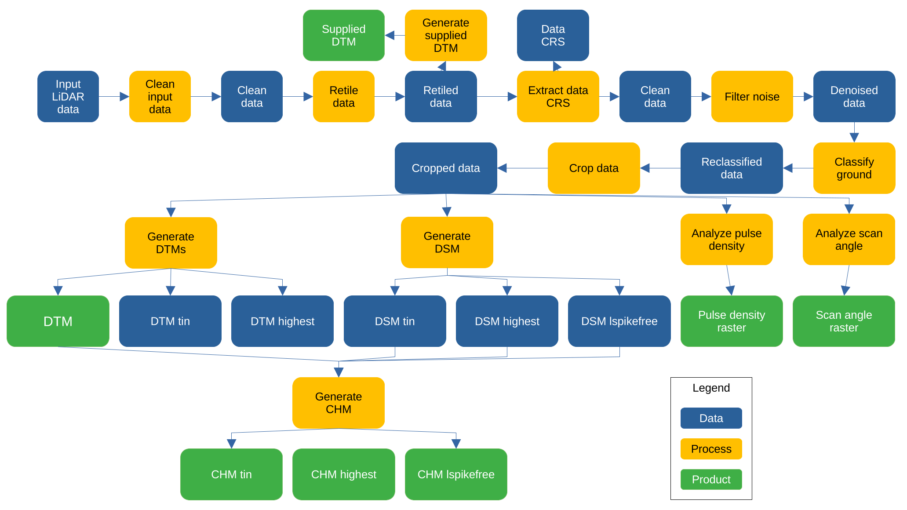

```{r setup, include=FALSE}
knitr::opts_chunk$set(
  collapse = TRUE, echo = TRUE,
  comment = "#>", fig.align = "center")
require(knitr)
require(BIOMASS)
```

# Package description

The GCA pipeline is a tool used for the generation of Digital Terrain Model (DTM) and Canopy Height Model (CHM) from Aerial LiDAR Scanning (ALS) data.

# General workflow diagram



# Input data

# Parameters

-   name_job = "gca" overall job name, used for processing stats
-   type_file = "laz" type of the files to be processed, needs to be exact (las, laz, LAS, etc.)
-   dir_dataset = "/media/andres/DATA/Lidar/ALS/test/light/BCI" folder that contains data sets
-   dir_processed = "/home/andres/work/projects/GEO-TREES/03-development/GCA/ALS_processing/v.1.0.4_open_option/processed" folder where processed data sets should be saved
-   path_lastools = "" folder to most recent lastools installation
-   tmpdir_processing = "/home/andres/work/projects/GEO-TREES/03-development/GCA/ALS_processing/v.1.0.4_open_option/tmp" !!!: folder where processing occurs: files will be overwritten and should never be a folder that is synchronized or has slow read/write operations, i.e., no Dropbox folders, no OneDrive, and not an external hard drive resolution = 1.0 resolution of raster products (in m)
-   n_cores = 20 number of cores for processing, keep 1-2 cores available for system operations
-   size_tile = 250 retiling size
-   size_buffer = 50 25m - 50m, 50 m should be sufficient for any type of acquisition (25m may be too small for ground point classification in sparse scans)
-   force.utm = "from_metadata" force reprojection of system into UTM (and meter) coordinates; necessary for all files that are registered in feet, otherwise output will be in feet
-   force.recompute = T force reprocessing; usually set to FALSE, useful when computation has been interrupted for external reasons (power cutofff) and needs to be restarted, because only unprocessed data subsets will be reprocessed
-   remove.vlr = T probably not necessary in most cases, but should be generally activated. The option leads to the removal of all vlrs AFTER the CRS of the first raster product is set. The CRS will be transmitted to all other raster products, so outputs will not be affected. By deactivating vlrs afterwards we prevent problems with further terra or lastools processing due to odd projection information, which sometimes causes an excess of warnings/errors (and shutdown of parallel processing) or blast2dem to fail
-   remove.evlr = T probably not necessary in most cases, but should be generally activated. The option leads to the removal of all evlrs AFTER the CRS of the first raster product is set. The CRS will be transmitted to all other raster products, so outputs will not be affected. By deactivating evlrs afterwards we prevent problems with further terra or lastools processing due to odd projection information, which sometimes causes an excess of warnings/errors (and shutdown of parallel processing) or blast2dem to fail
-   use.blast2dem = F should be activated by default as it improves (or makes possible) TIN construction in very dense point clouds, but: not tested on Linux so far
-   type_architecture = "64" only needed if 32bit Windows should be forced; 32 can be a bit more permissive, particularly for blast2dem

# Output products

-   Supplied DTM
-   DTM
-   CHM
    -   TIN
    -   Highest
    -   Lspikefree
-   Pulse density raster
-   Scan angle raster
