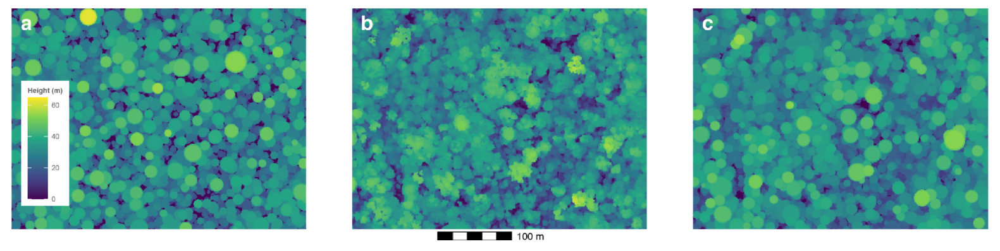

```{r setup, include=FALSE}
knitr::opts_chunk$set(
  collapse = TRUE, echo = TRUE,
  comment = "#>", fig.align = "center")
require(knitr)
```

# List of accronyms

- **GCA**: Global Canopy Atlas
- **DTM**: Digital Terrain Model
- **DSM**: Digital Surface Model
- **CHM**: Canopy Height Model
- **ALS**: Aerial Lidar Scanning
- **CRS**: Coordinate Reference System
- **UTM**: Universal Transverse Mercator
- **TIN**: Triangle Irregular Network
- **MAAP**: Multi-Mission Algorithm and Analysis Platform
- **ESA**: European Space Agency

# Introduction

The current document summarizes the development work being done on the Global Canopy Atlas pipeline in the context of the FRM4BIOMASS project. 

The Global Canopy Atlas pipeline is composed by a series of functions that process Aerial Scanning Lidar (ALS) data in order to produce Digital Terrain Model (DTM) and Canopy Height Model (CHM) rasters of the study area as output product. The pipeline takes as input a set lidar pointcloud files of the target region, preprocesses them to ensure the quality of the data, classifies the ground points and then produces the DTM and CHM products. The purpose of this processing is to use these products for the generation of Above Ground Biomass (AGB) rasters of the target region.

The pipeline repository, with source code and documentation, can be found at: https://github.com/fischer-fjd/GCA

This pipeline is in an advanced state of development, with a thorough data validation process that focuses on robustness and reliability. This work is presented in: https://besjournals.onlinelibrary.wiley.com/doi/10.1111/2041-210X.14416

On the development side, the pipeline is fully implemented in R, with a strong dependency on a commercial software called LAStools, a reference library in the lidar processing environment.

# Motivation

The motivation of this development project is to make the pipeline completely open source. The main purposes of this evolution are to:

- Make the pipeline accessible for all the forest ecology community, so anyone can contribute and use the pipeline

- Make the pipeline usable by forest ecology actors that can not or do not desire to acquire commercial licenses

- Have a better understanding and control of the algorithms used by the pipeline

- Integrate the pipeline in the MAAP computing platform, which only accepts open source applications

For this, the pipeline needs to be modified to guarantee:

- Open source status for all functions used in the pipeline. The pipeline must be open, modifiable and free.

- Documentation of the whole workflow and of each individual function

- Direct integration of the pipeline on MAAP in order to have an easy and unified access to the processing of the data

# Development

The open source migration effort has been divided in two distinct parts: the substitution of generic pointcloud data processing functions (filtering, retiling, thinning, rasterizing, ...), which more commonly have an existing open source implementation, and the development of dedicated functions that do not have an open source equivalent (in terms of availability and performance compared to commercial software), such as the ground classification algorithm. Both are explained in detail in the following sections:

- **Open source -- Ground classification**

  The motivation for this development is the fact that the current open source algorithms for ground classification available on the lidR/lasR packages, Progressive Morphological Filter, Cloth Simulation Filter and MCC, do not have performances with an output quality comparable to that of LAStools, the commercial software used by the pipeline.
  
  Two main forest scenarios have been identified as challenging for ground classification:
  
  - **Rough terrain**
  
    Most ground classification algorithms are based on the detection of a continuous, relatively smooth surface defined by the last returns of the forest pointcloud, which represent the ground of the studied region. However, in rough terrain scenarios this smoothness is no longer so obvious to satisfy: an algorithm with a sufficient sensitivity to detect abrupt elevation changes will struggle on the classification, often producing false positives on points that belong to low vegetation. The most performant available open source algorithms will tend to over enforce smoothness, and the miss rough terrain sectors.
  
  - **Dense canopies**
  
    Dense canopy scenarios tend to be problematic for ground classification due to the fact that laser beams will statistically have fewer returns on the ground, as some regions will have sufficiently dense canopy that the laser beams have no or little returns on the ground. The ground classification in these regions will be challenging as this lack of ground observability can lead to the classification of vegetation points as ground.
  
  In the context of this work, a review of the state of the art, selection of the most promising method and its implementation have been conducted. The implemented method has been evaluated and the results compared with the commercial method, LAStools, and with the open source method, available in the lasR/lidR packages. A full report on this activity is in the final stages of development.

- **Open source -- General functions**

  The GCA pipeline has dependencies on commercial software also for a whole set of functions that pre process and post process the data along the DTM and CHM generation process. All these functions have to be substituted by an equivalent open source function. The approach of this work is based on the idea of using existing software functions in lidR (https://r-lidar.github.io/lidRbook/) and lasR (https://github.com/r-lidar/lasR).
  
  This work has been conducted for most of the pipeline. The open source equivalent for the generation of the CHM rasters, the last step of the pipeline, is still under development.


# Current challenges

The development of the open source version of the pipeline is in its final stages of development. However, some challenges have still to be addressed:

- Finish the implementation of all open source functions

  The integration of the open source equivalents for each LAStools function has not been as straight forward as initially expected. This is due to three main reasons:
  
    - The relatively big extent of the use of LAStools commertial sofware in the pipeline
    
      Almost every function of the pipeline has to be modified to be replaced by its open source alternative.
    
    - The different data processing philosophies between lidR/lasR and LAStools
    
      LAStools does not come with an R encapslation allowing for its direct usage on R scripts. For this reason, each LAStools function is executed through a R system call that will take a set of files both as input and output.
      
      LasR and lidR both are integrated on R, either throug encapsulation of precompiled code or directly coded in R. This allows for the input and output of each function to be directly passed as arguments between each stage of the pipeline.
      
      This difference in philosphies makes the development of th eopen source version involve also an architectural review of the pipeline stages.
    
    - The lack of obvious lidR/lasR alternative, for which other more low level R packages have to be used, as for example terra.
    
      A direct open source equivalent can be found for some function of the pipeline, but a new function has to be coded in R for some other stages of the pipeline.

# Future work

1. **Complete integration of the new ground classification algorithm in the pipeline**

	As explained in the Development section, the new ground classification algorithm is intended to become a more performant open source option compared to the existing algorithms in 	lidR/lasR.

	This new algorithm has been tested in a standalone approach, and validated with reference data obtained from the french national geographic institute (IGN). The next step is to integrate it in the pipeline to have a fully 	open source pipeline with performances closer to the commercial software 	equivalents (LAStools).
  
    To do this, two solutions are possible
  
    - Direct call to the pre-compiled executable from R, as done with LAStools functions
        
    - Wrap the C++ code in R to be able to be used directly from the R pipeline
    
2. **Re-factorization of the pipeline into subsets of modular functions**

	The current state of the pipeline has all the sub-functions coded in a common 	source file (named ALS_processing_helper_functions). This makes readability and maintenance of the code 	base complicated. A restructuring of this code into individual source    files for each function 	will be done to better organize the repository and have a faster maintenance 	of the pipeline.

3. **Integration and test of the pipeline in the MAAP platform**

	The ESA Multi-Mission Algorithm and Analysis Platform (ESA-MAAP) is a data storage and 	computing platform put  into service by ESA. This platform is available for the 	FRM4BIOMASS/GEO-TREES actors. The GCA pipeline will be deployed on the ESA-MAAP platform and eventually store data and products related to the use of this pipeline. 
	The platform is, to our current knowledge, not still operative for production 	use. Once this is the case, a deployment and test of the pipeline on the MAAP 	platform will be done. This will allow us to have a unified    reference point for 	the storage and access to the data, and to efficiently process the data used by the pipeline.

4. **Formal comparison and potential merge with Maryland’s university pipeline**

	In the last stages of the development, a collaboration with the university of 	Maryland has been established in the context of the GEO-TREES project. The 	team from Maryland works on their own pipeline, open-sourced,    but with 	different approaches compared to the ones used in our pipeline (notably for the DTM and CHM algorithms). 
	
	The pipeline source code and documentation can be found at: https://github.com/GEO-TREES/ALS_Panama

5. **Integration of the pipeline with the AGB estimation**

    - Production ready -- Landscape statistical up-scaling (BIOMASS)
    
      Use the BIOMASS package to, build an allometric relationship between (1) plot-based AGBD estimates produced by the BIOMASS R package     (https://cran.r-project.org/web/packages/BIOMASS/index.html) and (2) LiDAR-derived height summary statistics (e.g. mean or median) from a CHM for areas corresponding to the plot outlines. Then apply this relationship over the whole area covered by ALS data.
      
      More information on this approach and the package itself can be found on: https://umr-amap.github.io/BIOMASS/index.html

    - Experimental -- Individual tree based simulation (CanopyConstructor)

      The Canopy Constructor is a method that combines field inventory data collected over a limited area with canopy height models (CHMs) on a larger spatial extent to digitally reconstruct forests.
      
      The method operates in two main steps. First, it uses the available field inventory and CHM data to generate a virtual forest reconstruction over the inventoried area (usually in the range of a few tens of hectares). Each tree is described by a limited set of attributes: location (x, y), botanical identification, wood specific gravity, diameter at breast height (DBH), height, and crown dimensions (radius and depth). Relationships between several of these attributes (e.g., DBH and height) are modelled using simple (allometric) equations. The algorithm digitally draws the trees present within the inventory and, by slightly adjusting their positions or modifying their crown’s shape, simulates tree configurations to achieve the best possible fit between the observed and simulated canopy height models. In the second step, the parameters of the allometric relationships calibrated during the first phase, and the crown packing matrix obtained by the first fit, are used to extrapolate the simulation across the full CHM extent, this results in a virtual tree-level inventory over the entire area.

      ```{r canopy_constructor_example, echo=FALSE, message=FALSE, warnings=FALSE, fig.align = 'center', out.width = "75%", fig.cap = "Example of canopy reconstruction at the Petit Plateau             plot, Nouragues. Shown are the initial canopy height model (CHM) where tree dimensions are randomly drawn from site-allometries (a), the ALS-derived CHM (b), and the final                    reconstruction of the Canopy Constructor (Fisher et al., 2020)"}
          
      ```
      
      The result is a georeferenced inventory where each reconstructed tree is characterized by estimated physical attributes such as species, DBH, height, crown radius, and crown depth. The final output does not reproduce exactly the real forest but provides a statistically consistent simulation based on parameters calibrated from the reference plots, which are assumed to be representative, both in terms of structure and composition, of the broader landscape. The reconstruction of the forest and the estimated inventory provide the attributes for each tree, and it allows an accurate estimation of aboveground biomass at fine spatial resolution.
    
      This method addresses the limitations of traditional forest inventories, which are often spatially restricted and not reliable for tree height and crown radius measurements. By integrating lidar-derived canopy models with ground-based measurements, the Canopy Constructor provides fine-scale and individual-based reconstructions even in dense tropical forests. One of the key advantages of the Canopy Constructor method over traditional height-biomass relationships is that it more accurately captures the natural heterogeneity of the forest, avoiding the tendency to shrink Above-Ground Biomass (AGB) estimates towards the mean. This results in a more realistic representation of forest structure and biomass distribution, especially in complex environments. 
      
      More information on this approach and the package itself can be found on: https://github.com/fischer-fjd/CanopyConstructor
      


