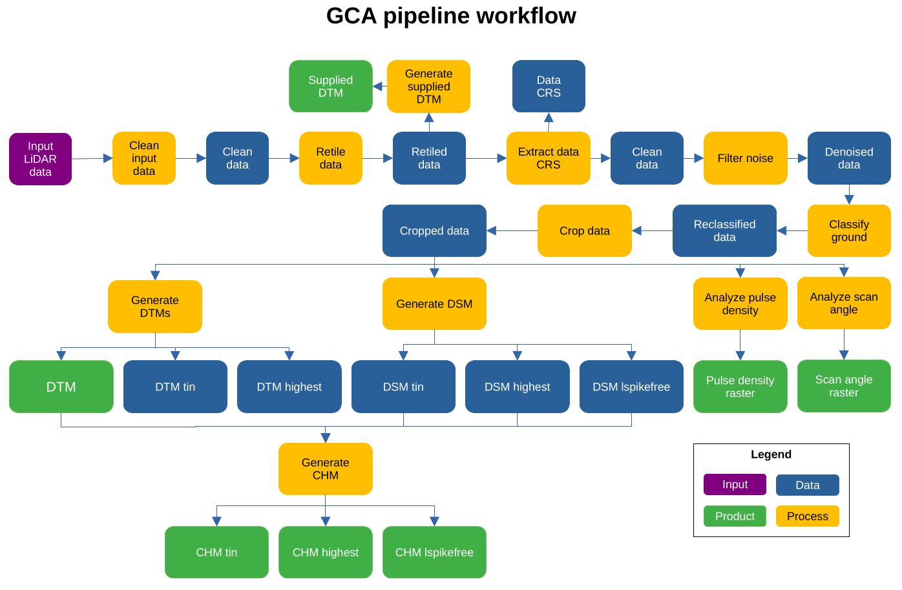
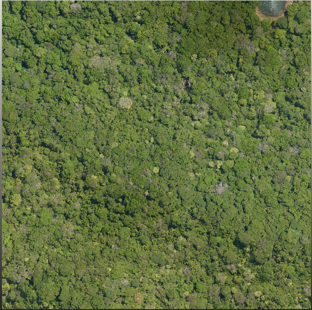
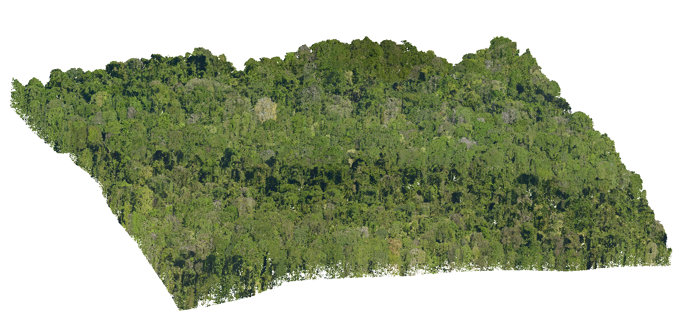

```{r setup, include=FALSE}
knitr::opts_chunk$set(
  collapse = TRUE, echo = TRUE,
  comment = "#>", fig.align = "center")
require(knitr)
```

# List of accronyms

- **GCA**: Global Canopy Atlas
- **DTM**: Digital Terrain Model
- **DSM**: Digital Surface Model
- **CHM**: Canopy Height Model
- **ALS**: Aerial Lidar Scanning
- **CRS**: Coordinate Reference System
- **UTM**: Universal Transverse Mercator
- **TIN**: Triangle Irregular Network
- **MAAP**: Multi-Mission Algorithm and Analysis Platform
- **ESA**: European Space Agency


# Package description

The GCA pipeline is a tool used for the generation of Digital Terrain Model (DTM) and Canopy Height Model (CHM) from Aerial LiDAR Scanning (ALS) data.

The package source code can be found at: https://github.com/fischer-fjd/GCA/tree/GCA_open_source


# General workflow 

- **Diagram**

The following figure shows a diagram of the pipeline workflow.

```{r workflow_diagram, echo=FALSE, message=FALSE, warnings=FALSE, fig.align = 'center', out.width = "100%", fig.cap = "Diagram of the GCA pipeline workflow"}

```

In this figure, the blue items represent data being processed by each step, the orange items represent the processing steps of the pipeline and the green items represent the final output products of the pipeline.

A detailed description of the pipeline's workflow is given in the following section.

- **Description**

  The pipeline main processing steps are:

  1. Clean input data: perform an initial clean of the data
    
  2. Retile .las/.laz files to the specified tile size
    
  3. Generate output from untreated point cloud (as .tif files for point classification and corresponding DTM via ‘lasgrid’ and ‘las2dem’        functions, upon information availability)
    
  4. Read CRS and then delete pointcloud user information
  
  5. Remove duplicate (xyz) points
  
  6. Remove noise points
  
  7. Classify (or reclassifiy) ground points;
  
  8. Crop canopy heights above a user-defined ‘maximum height’ (via ‘lasheight’ function); that ‘maximum height’ is used as a very coarse point cloud filter, assuming that trees never reach such height (e.g., 125 m here);
  
  9. gets pulse density and scan angle (as .tif files via ‘lasgrid’ function);
  
  10. creates DTMs (via ‘las2dem’ and/or ‘blast2dem’ functions);
    
  11. creates DSMs (via ‘las2dem’ and/or ‘blast2dem’ functions);
  
  12. creates thinned versions of DSMs (via ‘las2dem’ and/or ‘blast2dem’ functions);
    
  13. creates normalized point clouds (via ‘lasheight’ function);
    
  14. estimates laser penetration (via ‘lasgrid’ function)
    
  15. creates CHMs (via ‘las2dem’, ‘lassort’, ‘lasoptimize’ and/or ‘lasclip’ functions);
    
  16. computes canopy summary statistics from point clouds;
    
  17. produce synthesis files both by tile and for all tiles (as .csv files using metadata);


# Input data

The pipeline takes two items as input data: the set of input pointcloud files and a metadata file with information about the acquisiton data. Both are expalined in detail in the following sections.

- **Input pointcloud files**

The input pointcloud data is provided in the form of a folder containing a set of pointcloud files, in format LAS (.las) or its compressed equivalent LAZ (.laz). Normally each pointcloud file corresponds to a tile of the scanned landscape. All tiles must have the same Coordinate Reference System (CRS), which should be UTM compatible.

```{r lidar_tile, echo=FALSE, message=FALSE, warnings=FALSE, fig.align = 'center', out.width = "25%", fig.cap = "Top view of an example ALS data tile"}

```

```{r lidar_tile_side, echo=FALSE, message=FALSE, warnings=FALSE, fig.align = 'center', out.width = "25%", fig.cap = "Side view of an example ALS data tile"}

```

- **Aquisition metadata file**

A metadata file should be provided with the data in the same folder. This file shall contain:

```{r table1, echo=FALSE, message=FALSE, warnings=FALSE, results='asis'}
tabl <- "
|     General information |
|:---|-----------|
| Site name | Nouragues |
| Acquisition date | 15/11/2022 |
| Covered area  | 32 km2 |
| Pulse density  | 61.2 m-2 |
| Point density | 133.8 m-2 |
| Laser type | VQ 780II RIEGL |
| Wavelength | 1064 nm |
| Beam divergence | < 0.25 mrad (1/e2) |
| Vehicle  | Airplane BN2 |
| Operator | Altoa |

|     Point cloud data |
|:---|-----------|
| Data format | Las 1.4 (.laz) |
| Tile number | 128 |
| Tile size  | 500 × 500 m  |

|     Acquisition parameters |
|:---|-----------|
| Swath angle | ± 20 degrees |
| Pulse Repetition Rate (PRR) | ~ 1000 kHz |
| Ground footprint size of pulse  | ~ 0.16 m  |
| Flight height | 650 m AGL |
| Acquisition mode | online digitization |
| Note(s) | low altitude clouds forced acquisition altitude |

|     ROI bounding box |
|:---|-----------|
| Coordinate Reference System (CRS)  | EPSG:2972 |
| xmin   | 312000 |
| xmax  | 315458.9 |
| ymin  | 443000 |
| ymax  | 453500 |

|     Contextual info |
|:---|-----------|
| Funding  | ANR Labex CEBA |
| Contact   | Grégoire Vincent (gregoire.vincent@ird.fr) |
"
cat(tabl) # output the table in a format good for HTML/PDF/docx conversion
```


# Parameters

The pipeline has a set of parameters that can control how the processing of the input data is performed. The following table lists the most important ones:

```{r table2, echo=FALSE, message=FALSE, warnings=FALSE, results='asis'}
tabl <- "
| Name        | Description           | Default  |
|:---|--------------|:-|
| name_job      | Overall job name, used for processing stats | \"gca\" |
| type_file     | Type of the files to be processed, needs to be exact (las, laz)      |   \"las\" |
| dir_dataset   | Folder that contains data sets      |    \"\" |
| dir_processed | Folder where processed data sets should be saved      |    \"\" |
| path_lastools | Folder to most recent lastools installation      |    \"\" |
| tmpdir_processing | Folder where processing occurs (files will be overwritten)       |    \"\" |
| resolution | Resolution of raster products (in m)       |    1.0 |
| n_cores | Number of cores for processing       |    1 |
| size_tile | Retiling size       |    500 |
| size_buffer | Tile buffer size       |    50 |
| force.utm | Force reprojection of coordinate reference system into UTM (and meter) coordinates       |    True |
| force.recompute | Force reprocessing. Only unprocessed data subsets will be reprocessed       |    False |
"
cat(tabl) # output the table in a format good for HTML/PDF/docx conversion
```


# Usage

The GCA pipeline is a complete application that takes files as an input and will produce a set of different files as the product output. Therefore, the user must only satisfy the following steps in order to use the pipeline:

- Place the input data in the desired input folder

- Complete and verify the input data metadata

- Fill the desired values for each parameter

- Run the main file: ALS_processing.R

Then, the pipeline will process the data and generate the output products, which will be placed at the directory defined by the "dir_processed" parameter.


# Output products

-   Supplied DTM
-   DTM
-   CHM
    -   TIN
    -   Highest
    -   Lspikefree
-   Pulse density raster
-   Scan angle raster


