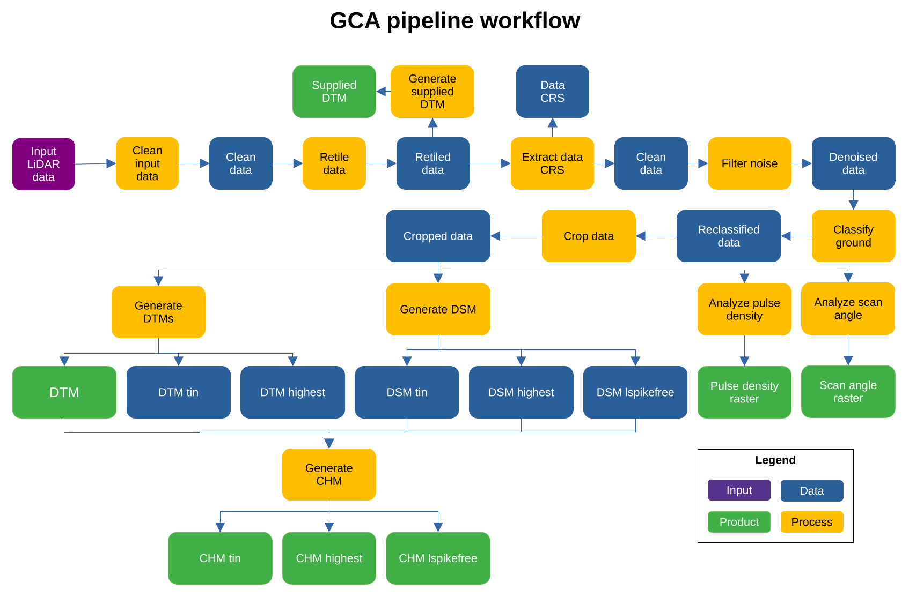

```{r setup, include=FALSE}
knitr::opts_chunk$set(
  collapse = TRUE, echo = TRUE,
  comment = "#>", fig.align = "center")
require(knitr)
```

# List of accronyms

- **GCA**: Global Canopy Atlas
- **DTM**: Digital Terrain Model
- **DSM**: Digital Surface Model
- **CHM**: Canopy Height Model
- **ALS**: Aerial Lidar Scanning
- **CRS**: Coordinate Reference System
- **UTM**: Universal Transverse Mercator
- **TIN**: Triangle Irregular Network
- **MAAP**: Multi-Mission Algorithm and Analysis Platform
- **ESA**: European Space Agency


# Package description

The GCA pipeline is a tool used for the generation of Digital Terrain Model (DTM) and Canopy Height Model (CHM) from Aerial LiDAR Scanning (ALS) data.

The package source code can be found at: https://github.com/fischer-fjd/GCA/tree/GCA_open_source


# General workflow 

- **Diagram**

The following figure shows a diagram of the pipeline workflow.



In this figure, the blue items represent data being processed by each step, the orange items represent the processing steps of the pipeline and the green items represent the final output products of the pipeline.

A detailed description of the pipelins workflow is given in the following section.

- **Description**

TODO


# Input data

The input data is provided in the form of a folder containing a set of pointcloud files, in format LAS (.las) or its compressed equivalent LAZ (.laz). Normally each pointcloud file corresponds to a tile of the scanned landscape. All tiles must have the same Coordinate Reference System (CRS), which should be UTM compatible.

A metadata file should be provided with the data in the same folder. This file shall contain:

- The data CRS
- etc

# Parameters

```{r table2, echo=FALSE, message=FALSE, warnings=FALSE, results='asis'}
tabl <- "
| Name        | Description           | Default  |
|-:|--------------|-|
| name_job      | Overall job name, used for processing stats | \"gca\" |
| type_file     | Type of the files to be processed, needs to be exact (las, laz)      |   \"las\" |
| dir_dataset   | Folder that contains data sets      |    \"\" |
| dir_processed | Folder where processed data sets should be saved      |    \"\" |
| path_lastools | Folder to most recent lastools installation      |    \"\" |
| tmpdir_processing | Folder where processing occurs (files will be overwritten)       |    \"\" |
| resolution | Resolution of raster products (in m)       |    1.0 |
| n_cores | Number of cores for processing       |    1 |
| size_tile | Retiling size       |    500 |
| size_buffer | Tile buffer size       |    50 |
| force.utm | Force reprojection of coordinate reference system into UTM (and meter) coordinates       |    True |
| force.recompute | Force reprocessing. Only unprocessed data subsets will be reprocessed       |    False |
"
cat(tabl) # output the table in a format good for HTML/PDF/docx conversion
```


# Usage

- Place the input data in the desired input folder

- Complete and verify the input data metadata

- Fill the desired values for each parameter

- Run the main file: ALS_processing.R


# Output products

-   Supplied DTM
-   DTM
-   CHM
    -   TIN
    -   Highest
    -   Lspikefree
-   Pulse density raster
-   Scan angle raster


